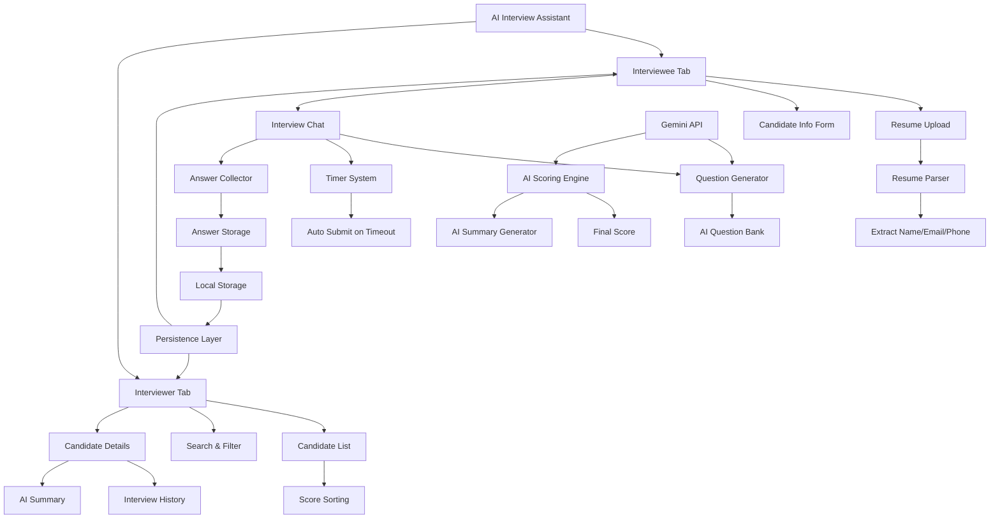

```mermaid
graph TD
    A[AI Interview Assistant] --> B[Interviewee Tab]
    A --> C[Interviewer Tab]
    
    B --> D[Resume Upload]
    B --> E[Candidate Info Form]
    B --> F[Interview Chat]
    
    F --> G[Question Generator]
    F --> H[Timer System]
    F --> I[Answer Collector]
    
    C --> J[Candidate List]
    C --> K[Search & Filter]
    C --> L[Candidate Details]
    
    D --> M[Resume Parser]
    M --> N[Extract Name/Email/Phone]
    
    G --> O[AI Question Bank]
    H --> P[Auto Submit on Timeout]
    I --> Q[Answer Storage]
    
    J --> R[Score Sorting]
    L --> S[Interview History]
    L --> T[AI Summary]
    
    Q --> U[Local Storage]
    U --> V[Persistence Layer]
    
    V --> B
    V --> C
    
    W[Gemini API] --> G
    W --> X[AI Scoring Engine]
    X --> Y[Final Score]
    X --> Z[AI Summary Generator]
```